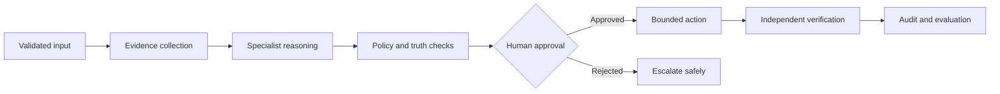

### Building ambitious AI systems that remain measurable, reviewable, and useful in production

  
  
  
  

  
  
  
  

  <a href="#-about-me">About</a> &nbsp;|&nbsp;
  <a href="#-professional-experience--impact">Experience</a> &nbsp;|&nbsp;
  <a href="#-featured-ai-systems">Projects</a> &nbsp;|&nbsp;
  <a href="#-technology-stack">Stack</a> &nbsp;|&nbsp;
  <a href="#-github-snapshot">GitHub</a>

---

## 👨‍💻 About Me

I am an **Applied AI / ML Engineer and Full-Stack Developer** with 5+ years of experience building **LLM applications, retrieval-augmented generation systems, predictive models, data platforms, APIs, and production-facing interfaces**.

I like working across the entire path from an ambiguous idea to a system people can trust: defining the decision, preparing the data, designing retrieval or model behavior, creating typed service boundaries, building the interface, evaluating quality, and instrumenting what happens after release.

My work spans the complete AI product lifecycle:

- 🧠 **Generative AI:** RAG, semantic and hybrid search, agentic workflows, prompt engineering, evaluation, guardrails, and grounded answers
- 📈 **Machine Learning:** classification, anomaly detection, recommendation systems, forecasting, NLP, explainability, and model monitoring
- ⚙️ **AI Engineering:** FastAPI services, async workflows, vector databases, MLOps pipelines, testing, observability, and cloud deployment
- 💻 **Full-Stack Development:** Python and Go backends, REST APIs, React/Next.js interfaces, TypeScript, responsive experiences, and developer tooling
- 🔐 **Responsible Automation:** evidence-linked outputs, prompt-injection boundaries, human approval, least privilege, fail-closed recovery, and transparent audit trails

> I enjoy turning ambitious ideas into measurable AI products without hiding uncertainty, evidence, or operational trade-offs.

### At a glance

| Experience | Production scale | Product impact | Public project quality |
|---|---:|---:|---:|
| **5+ years** across AI, data science, and data engineering | **500K+** records scored daily | Up to **55%** less manual review | Up to **98%** statement coverage |

### How I engineer agentic systems

The common thread across my recent projects is intentional control: agents receive narrow contracts, important claims cite evidence, partial failures stay visible, and execution never becomes proof of success without separate verification.

---

## 💼 Professional Experience & Impact

### 🎓 Saint Louis University - GenAI / ML Engineer
`Jan 2025 - Present`

- Shipped an **LLM-powered learning and research assistant** used across multiple departments, reducing average time-to-answer by approximately **40%** through **RAG, semantic search, and FastAPI services**.
- Architected an enterprise **RAG pipeline** across research papers, institutional documents, and structured data using **LangChain, LangGraph, FAISS, and hybrid retrieval (BM25 + embeddings)**.
- Designed **agentic, human-in-the-loop workflows** for planning, retrieval, validation, and task routing.
- Built recommendation and early-intervention ML capabilities from learner engagement and performance signals.
- Productionized AI workloads with **Docker, Azure, Databricks, MLflow, structured logging, evaluation pipelines, and responsible-AI guardrails**.

### 📊 Boston Consulting Group (BCG) - Data Scientist
`Aug 2023 - Dec 2024`

- Improved model **AUC-ROC by approximately 14%** and scored **500K+ records daily at sub-100 ms latency** using XGBoost, LightGBM, and Isolation Forest.
- Reduced manual document-review time by approximately **55%** with a **BERT-based document-intelligence pipeline**.
- Applied **SHAP and LIME** for explainability, model cards, fairness analysis, and regulatory review.
- Built customer segmentation, NLP risk monitoring, forecasting, and production ML services using **PySpark, MLflow, AWS SageMaker, REST APIs, and React dashboards**.
- Translated model results, assumptions, and trade-offs into clear recommendations for technical and non-technical stakeholders.

### 🏭 Bosch - Data Engineer
`Feb 2021 - Jun 2022`

- Centralized data from **6+ enterprise sources** into governed ETL/ELT pipelines with **PySpark and Apache Airflow**.
- Reduced downstream pipeline errors by approximately **45%** through automated schema, integrity, freshness, and statistical quality checks.
- Improved reporting and query performance through **Databricks, Azure, PostgreSQL, MySQL, indexing, and schema optimization**.
- Developed secure **REST APIs**, CI/CD automation, infrastructure-as-code workflows, monitoring, and unit/integration test coverage.
- Delivered backend and internal web tooling with **Python, Django, SQL, JWT, and role-based access control**.

---

## 🚀 Featured AI Systems

These are not thin model wrappers. Each project explores a different production architecture, safety boundary, evaluation strategy, and user workflow.

### 📈 RiskLedger

An event-sourced, risk-governed paper-trading replay that demonstrates how to make a safety-critical AI workflow **deterministic, reviewable, and fail-closed**.

- Deterministic analysis that cites a sealed market scenario and prevents look-ahead bias
- Independent risk-policy veto, immutable proposal digest, and human approval bound to the exact event-stream version
- Hard budgets for steps, retries, active time, and cost units; exhaustion safely stops the workflow
- Local-only paper simulator with no broker adapter, credentials, market-data dependency, or real-money path
- Append-only, hash-linked event history and an independent reconciler that must balance before completion
- **47 passing tests and 87.87% coverage** across unit, integration, and local-demo flows

<b>Why this architecture matters</b>

 
RiskLedger treats “no trade” as a valid safe result. Generating a proposal never grants execution authority: a separate policy must pass, a human must approve the exact proposal in time, and an independent reconciler must verify the simulated outcome.

### 🚨 IncidentPilot

A local-first incident decision-support system demonstrating **bounded, human-gated remediation** from evidence-linked triage through fresh SLO verification.

- Typed incident state machine with deterministic synthetic telemetry and traceable observation IDs
- Independent policy and executor allowlists, with no arbitrary shell, URL, script, or action parameters
- Human approval bound to the exact proposal, evidence, policy digest, TTL, and run deadline
- Separate verifier that resolves an incident only after fresh telemetry passes every SLO check
- Hash-linked append-only audit history, bounded retries, race detection, and an 80%+ coverage gate
- Scratch container running as a non-root UID/GID with hardened CI smoke tests

<b>Why this architecture matters</b>

 
Executor success is deliberately not treated as recovery. IncidentPilot separates proposing, authorizing, executing, and verifying so each boundary can fail safely and remain inspectable. `FAIL` or `INCONCLUSIVE` verification escalates instead of silently replanning.

### 🧭 Career Application Copilot

An evidence-grounded, human-approved multi-agent system for tailoring job-application drafts **without inventing candidate experience**.

- Specialist nodes for requirement extraction, evidence matching, grounded writing, and truthfulness review
- Immutable evidence bank and frozen Pydantic contracts at every workflow boundary
- Explicit skill gaps when experience is unsupported, with no unmatched-evidence fallback
- Citation review that rejects unsupported language even when it is attached to a valid evidence ID
- Final state exposes a reviewable draft, not an employer-contact or application-submission tool
- **20 passing tests, 98.25% statement coverage**, and a versioned capability corpus with 100% scores across five measured behaviors

<b>Measured capability baseline</b>

 
The three-case evaluation corpus measures requirement recall, gap preservation, citation coverage, truthfulness, and human-gate compliance. It also contains adversarial regressions for unsupported text with a valid citation ID and unmatched-evidence fallback.

### 🛡️ PR Sentinel

An evidence-first pull-request review system that fans an untrusted unified diff across independent security, correctness, and test actors at the edge.

- Safe text parsing with line-cited findings; submitted code is never cloned, imported, or executed
- Failure-isolated parallel fan-out using typed messages and `Promise.allSettled`
- Deterministic synthesizer that deduplicates evidence and marks incomplete reviews inconclusive
- Credential-value redaction before findings reach the API response or interface
- No merge, comment, repository token, or remote write capability in the public architecture
- **12 passing tests, 98% statement coverage, and 0 known dependency vulnerabilities**

<b>Why an actor mesh</b>

 
Security, correctness, and test analysis are independent and latency-sensitive. The actor design runs them concurrently without shared mutable review state, preserves partial evidence when one actor fails, and still blocks approval until every required reviewer completes.

### 🧠 SignalForge AI / Interest Intelligence Agent

A customizable intelligence system for converting shared links, messages, files, screenshots, photos, video, voice notes, and raw thoughts into structured intelligence cards.

- Extracts content, questions, answers, classifications, relevance, connections, and possible next actions
- Accuracy, cost, and custom modes for different depth and personalization requirements
- Markdown and JSON card outputs with an Obsidian-compatible knowledge workflow
- Profile-aware analysis and dry-run processing for review before writing
- Honest platform boundaries: exported WhatsApp data rather than fragile personal-chat automation

### 🧩 CodeAtlas AI / Personal Code Agent V2

A local AI architect and senior-engineering assistant for understanding, reviewing, planning, and safely improving clean-room codebases.

- Secret-aware scanning before local indexing, with exclusions for sensitive and generated files
- Structural chunking for Python, Markdown, Terraform, YAML-like formats, and generic source
- Keyword, path, symbol, and optional semantic retrieval for evidence-grounded reasoning
- Architecture reviews, implementation plans, diff previews, and explicit exact-text patch application
- Changes require `--apply`; validation commands must match a configured allowlist
- CLI, local FastAPI daemon, conservative no-LLM fallbacks, and a thin VS Code client

### 🔎 Personal Code Agent V1

The first clean-room version of my local code-understanding pipeline.

- Safe scanning and secret redaction before indexing
- Python AST-aware chunking plus structural handling for Terraform, YAML, and Markdown
- Lexical and optional vector retrieval with conservative, evidence-grounded answers
- Focused automated coverage for scanning, redaction, chunking, and retrieval

### 🌐 Developer Portfolio

An editorial, motion-rich portfolio presenting AI work as a sequence of visual research case files.

- Seven project stories with pinned desktop transitions and touch-friendly mobile stacking
- Kinetic typography, contextual system visuals, and locally hosted GSAP choreography
- Reduced-motion, missing-library, and background-tab fallbacks
- Responsive behavior verified across desktop and mobile layouts
- Lighthouse results of **100 desktop performance** and **96 mobile performance**, with 100 accessibility and best-practice scores

---

## 🧰 Technology Stack

### AI, ML & NLP

  

### Backend & Full-Stack

  

### Data, Cloud & MLOps

  

---

## 🏆 Certifications

- **Databricks Certified Machine Learning Associate**
- **Microsoft Certified: Azure AI Engineer Associate (AI-102)**
- **AWS Certified Machine Learning - Specialty**
- **Databricks Certified Data Engineer Associate**

---

## 📊 GitHub Snapshot

---

## 🎯 What I’m Building Next

- Production-ready evaluations, traces, and observability for RAG and multi-agent systems
- Durable identity, storage, and policy controls for human-gated automation
- Safer local developer agents with grounded retrieval and reviewable changes
- Full-stack AI products that connect model quality to polished user experiences
- Public demos that make architectural trade-offs, cost, and failure behavior visible

---

## 🤝 Let’s Connect

I’m open to opportunities involving **Applied AI, Machine Learning, Generative AI, AI Engineering, MLOps, Data Science, and Full-Stack AI development**.

### Build useful AI. Measure it. Make it reliable. Ship it.

